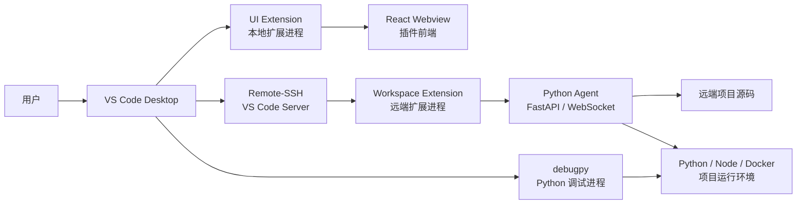
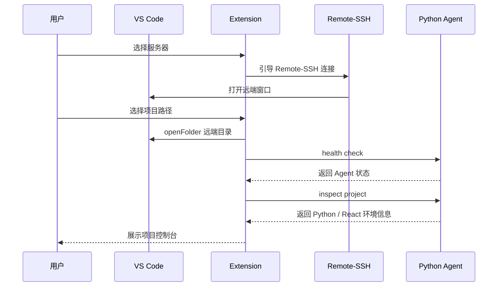
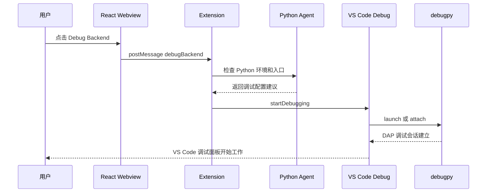
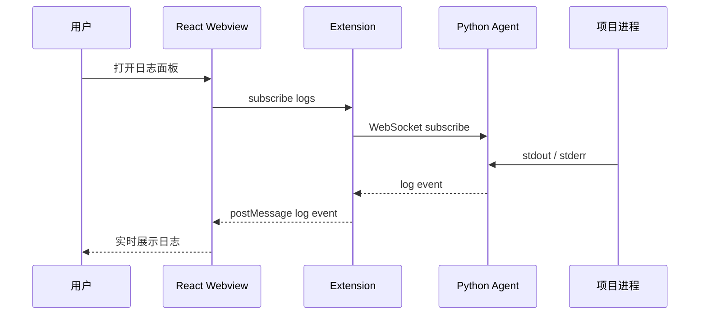

# VS Code 远端项目开发调试插件架构设计

## 1. 背景与目标

本方案设计一个 VS Code 插件系统，用于连接远端服务器，展示远端项目源代码，并支持在 VS Code 内调试远端项目。

技术约束：

- 插件前端：React
- 后端服务：Python
- 编辑器平台：VS Code Extension API
- 远端连接：优先复用 VS Code Remote-SSH / VS Code Server
- 调试协议：优先复用 Debug Adapter Protocol，Python 调试优先复用 `debugpy`

目标能力：

- 在 VS Code 中选择远端服务器和项目
- 打开远端项目源代码
- 展示远端项目状态、依赖、环境变量、运行进程、日志
- 支持启动、停止、重启远端项目
- 支持 Python 后端远程调试
- 支持 React 前端项目启动与浏览器调试扩展
- 支持企业级权限、安全、审计和可观测性

## 2. 总体结论

推荐架构不是自己从零实现一个远程 IDE，而是：

```text
VS Code Remote-SSH 负责远端文件系统和 VS Code Server
VS Code Extension 负责产品入口、命令、调试编排
React Webview 负责插件可视化界面
Python Agent 负责远端项目管理、环境探测、进程管理、日志流
debugpy / DAP 负责 Python 远程调试
```

这样做的好处是：

- 可以直接使用 VS Code 原生文件树、编辑器、搜索、Git、终端能力
- 不需要自己实现完整远程文件同步
- 不需要自己实现完整调试 UI
- 插件只聚焦业务价值：远端项目管理、启动调试、日志和环境治理
- 后续可以平滑扩展到 Dev Container、Kubernetes、SAE、ECS 等场景

## 3. 核心架构



## 4. 模块划分

### 4.1 VS Code Extension

Extension 是整个系统的控制层，建议使用 TypeScript 实现。

核心职责：

- 注册 VS Code 命令
- 注册左侧 Activity Bar / Tree View / Webview View
- 管理远端服务器配置
- 打开远端项目目录
- 与 React Webview 通信
- 与远端 Python Agent 通信
- 生成并启动 debug configuration
- 监听调试状态、终端输出、任务状态

推荐插件命令：

```json
{
  "commands": [
    {
      "command": "remoteDev.connect",
      "title": "Remote Dev: Connect Server"
    },
    {
      "command": "remoteDev.openProject",
      "title": "Remote Dev: Open Remote Project"
    },
    {
      "command": "remoteDev.startBackend",
      "title": "Remote Dev: Start Python Backend"
    },
    {
      "command": "remoteDev.debugBackend",
      "title": "Remote Dev: Debug Python Backend"
    },
    {
      "command": "remoteDev.startFrontend",
      "title": "Remote Dev: Start React Frontend"
    },
    {
      "command": "remoteDev.showLogs",
      "title": "Remote Dev: Show Logs"
    }
  ]
}
```

### 4.2 React Webview

React Webview 是插件的前端控制台。

适合展示：

- 服务器列表
- 项目列表
- 项目运行状态
- Python 虚拟环境状态
- 依赖安装状态
- 后端服务端口
- 前端服务端口
- 运行日志
- Debug 按钮
- 环境变量配置
- 最近失败任务 / 最近错误日志

Webview 不应该直接访问远端服务器，应该通过 VS Code Extension 中转：

```text
React Webview
   ↓ postMessage
VS Code Extension
   ↓ HTTP / WebSocket / VS Code API
Python Agent / VS Code Remote
```

原因：

- Webview 是隔离环境，直接持有 SSH 凭据不安全
- 统一由 Extension 管理 SecretStorage
- 方便做权限校验、日志审计和错误处理

### 4.3 Python Agent

Python Agent 部署在远端服务器上，可以由插件自动安装和启动，也可以作为企业标准组件预装。

推荐技术栈：

```text
FastAPI
Uvicorn
Pydantic
WebSocket
debugpy
psutil
watchfiles
```

核心职责：

- 探测项目结构
- 探测 Python 版本、虚拟环境、依赖
- 探测 Node.js / pnpm / npm 环境
- 启动和停止项目进程
- 返回项目运行状态
- 流式返回日志
- 生成调试启动参数
- 启动 debugpy
- 做命令执行审计

建议 Agent 只监听远端本机地址：

```text
127.0.0.1:17890
```

本地 VS Code 通过 Remote-SSH 端口转发访问，不建议直接暴露公网端口。

## 5. 远端连接方案

### 5.1 推荐方案：复用 Remote-SSH

VS Code Remote-SSH 可以打开远端机器上的任意目录，并让 VS Code 像本地一样编辑远端文件。

推荐流程：

```text
1. 用户配置 SSH Host
2. VS Code Remote-SSH 连接服务器
3. VS Code Server 自动安装到远端
4. 用户选择远端项目目录
5. 插件在远端 Workspace Extension Host 中运行
6. 插件启动 Python Agent
7. React Webview 展示项目控制台
```

优点：

- 文件树、编辑器、搜索、Git、终端都是 VS Code 原生能力
- 调试、断点、变量查看也能复用 VS Code 原生 UI
- 远端扩展可以直接访问远端 workspace 文件
- 企业落地成本最低

### 5.2 备选方案：自研 Remote FileSystemProvider

如果不能依赖 Remote-SSH，可以自研一个 `FileSystemProvider`：

```text
remote-dev://server-id/path/to/project
```

然后通过 SSH / SFTP / Agent API 读取远端文件。

但是不推荐作为第一版，原因是：

- 文件编辑、保存、冲突处理复杂
- 搜索、Git、终端、调试体验很难追平 Remote-SSH
- 大项目性能和缓存策略复杂
- 调试时仍然需要解决远端路径映射问题

因此，企业级第一版建议直接基于 Remote-SSH。

## 6. 远端源代码展示方案

推荐直接打开远端目录作为 VS Code workspace：

```text
Remote-SSH Window
   ↓
File -> Open Folder
   ↓
/data/projects/demo-backend
```

插件不需要自己做完整文件树，只需要提供项目入口：

```text
服务器列表
   └── 项目列表
        ├── 打开项目
        ├── 启动后端
        ├── 调试后端
        └── 查看日志
```

源代码展示由 VS Code 原生 Explorer 完成。

## 7. Python 后端调试方案

### 7.1 推荐调试方式

Python 项目调试建议复用 VS Code Python 插件和 `debugpy`。

调试启动模式分两种：

```text
launch：由 VS Code 启动 Python 程序
attach：Python 程序先启动 debugpy，VS Code 再连接上去
```

开发环境推荐 `launch`，线上或容器内调试推荐 `attach`。

### 7.2 launch 模式

插件可以动态生成调试配置，然后调用：

```ts
await vscode.debug.startDebugging(workspaceFolder, {
  type: "python",
  request: "launch",
  name: "Debug Python Backend",
  program: "${workspaceFolder}/backend/main.py",
  cwd: "${workspaceFolder}",
  console: "integratedTerminal",
  envFile: "${workspaceFolder}/.env",
  justMyCode: false
});
```

适用场景：

- FastAPI / Flask / Django 本地开发式远端调试
- 远端机器就是开发环境
- 用户希望点一个按钮启动并断点调试

### 7.3 attach 模式

远端程序启动时开启 debugpy：

```bash
python -m debugpy --listen 127.0.0.1:5678 --wait-for-client -m uvicorn app.main:app --host 0.0.0.0 --port 8000 --reload
```

VS Code 调试配置：

```json
{
  "name": "Attach Python Backend",
  "type": "python",
  "request": "attach",
  "connect": {
    "host": "127.0.0.1",
    "port": 5678
  },
  "pathMappings": [
    {
      "localRoot": "${workspaceFolder}",
      "remoteRoot": "${workspaceFolder}"
    }
  ],
  "justMyCode": false
}
```

在 Remote-SSH 窗口中，`localRoot` 和 `remoteRoot` 通常可以都使用 `${workspaceFolder}`，因为 VS Code 当前 workspace 本身就是远端目录。

适用场景：

- 服务已经由 Docker Compose / systemd / supervisor 启动
- 需要调试容器内进程
- 需要保留与生产更接近的启动方式

## 8. React 前端调试方案

如果远端项目包含 React 前端，可以支持两类能力：

### 8.1 启动远端前端开发服务

Python Agent 或 Workspace Extension 执行：

```bash
pnpm install
pnpm dev --host 0.0.0.0
```

然后通过 VS Code 端口转发访问：

```text
remote: 5173
local: 5173
```

React Webview 可以显示：

```text
前端服务：running
远端端口：5173
本地访问：http://localhost:5173
```

### 8.2 浏览器调试

前端断点调试可以使用 VS Code JavaScript Debugger：

```json
{
  "name": "Debug React Frontend",
  "type": "chrome",
  "request": "launch",
  "url": "http://localhost:5173",
  "webRoot": "${workspaceFolder}/frontend"
}
```

如果是 Vite / Next.js / CRA，需要根据项目实际结构设置 `webRoot` 和 sourcemap。

## 9. Python Agent API 设计

### 9.1 健康检查

```http
GET /health
```

返回：

```json
{
  "status": "ok",
  "version": "0.1.0",
  "hostname": "dev-server-01"
}
```

### 9.2 项目列表

```http
GET /projects
```

返回：

```json
[
  {
    "id": "demo-backend",
    "name": "demo-backend",
    "path": "/data/projects/demo-backend",
    "type": "python-react",
    "lastOpenedAt": "2026-05-19T12:00:00Z"
  }
]
```

### 9.3 项目探测

```http
POST /projects/inspect
```

请求：

```json
{
  "path": "/data/projects/demo-backend"
}
```

返回：

```json
{
  "python": {
    "version": "3.11.8",
    "venv": "/data/projects/demo-backend/.venv",
    "framework": "fastapi",
    "entrypoint": "app.main:app"
  },
  "frontend": {
    "packageManager": "pnpm",
    "framework": "react",
    "devCommand": "pnpm dev",
    "port": 5173
  }
}
```

### 9.4 启动进程

```http
POST /processes/start
```

请求：

```json
{
  "projectPath": "/data/projects/demo-backend",
  "name": "backend",
  "command": "uvicorn app.main:app --host 0.0.0.0 --port 8000 --reload",
  "env": {
    "ENV": "dev"
  }
}
```

返回：

```json
{
  "processId": "proc_123",
  "pid": 39122,
  "status": "running"
}
```

### 9.5 日志流

```http
GET /processes/{processId}/logs/ws
```

WebSocket 消息：

```json
{
  "time": "2026-05-19T12:00:00Z",
  "stream": "stdout",
  "message": "Uvicorn running on http://0.0.0.0:8000"
}
```

### 9.6 启动 debugpy

```http
POST /debug/python/attach
```

请求：

```json
{
  "projectPath": "/data/projects/demo-backend",
  "module": "uvicorn",
  "args": ["app.main:app", "--host", "0.0.0.0", "--port", "8000", "--reload"],
  "debugPort": 5678,
  "waitForClient": true
}
```

返回：

```json
{
  "debugPort": 5678,
  "pid": 39201,
  "status": "waiting_for_client"
}
```

## 10. 关键业务流程

### 10.1 连接服务器并打开项目



### 10.2 调试 Python 后端



### 10.3 查看日志



## 11. 项目目录结构建议

```text
remote-dev-vscode/
├── apps/
│   ├── extension/
│   │   ├── src/
│   │   │   ├── extension.ts
│   │   │   ├── commands/
│   │   │   ├── remote/
│   │   │   ├── debug/
│   │   │   ├── webview/
│   │   │   └── security/
│   │   ├── package.json
│   │   └── tsconfig.json
│   ├── webview/
│   │   ├── src/
│   │   │   ├── App.tsx
│   │   │   ├── pages/
│   │   │   ├── components/
│   │   │   ├── stores/
│   │   │   └── api/
│   │   ├── vite.config.ts
│   │   └── package.json
│   └── agent/
│       ├── remote_dev_agent/
│       │   ├── main.py
│       │   ├── api/
│       │   ├── services/
│       │   ├── process/
│       │   ├── debug/
│       │   ├── security/
│       │   └── schemas/
│       ├── pyproject.toml
│       └── README.md
├── packages/
│   ├── protocol/
│   │   └── schemas/
│   └── shared/
├── docs/
│   ├── architecture.md
│   ├── security.md
│   └── deployment.md
└── README.md
```

## 12. 数据模型设计

### 12.1 ServerProfile

```ts
interface ServerProfile {
  id: string;
  name: string;
  host: string;
  port: number;
  username: string;
  authType: "ssh-key" | "password" | "agent";
  sshConfigHost?: string;
  createdAt: string;
  updatedAt: string;
}
```

敏感信息不放在普通配置文件中，应该使用 VS Code SecretStorage。

### 12.2 ProjectProfile

```ts
interface ProjectProfile {
  id: string;
  serverId: string;
  name: string;
  remotePath: string;
  backend?: {
    framework: "fastapi" | "flask" | "django" | "unknown";
    entrypoint: string;
    port: number;
    envFile?: string;
  };
  frontend?: {
    framework: "react" | "next" | "vite" | "unknown";
    packageManager: "pnpm" | "npm" | "yarn";
    devCommand: string;
    port: number;
  };
}
```

### 12.3 ProcessInfo

```ts
interface ProcessInfo {
  id: string;
  projectId: string;
  name: string;
  pid: number;
  command: string;
  status: "starting" | "running" | "stopped" | "failed";
  startedAt: string;
  exitCode?: number;
}
```

## 13. 安全设计

### 13.1 SSH 凭据安全

推荐：

- 优先使用 SSH Key
- 支持系统 SSH Agent
- 密码只允许临时输入
- 不在项目配置中保存明文密码
- 使用 VS Code SecretStorage 保存 token 或必要密钥引用

### 13.2 Agent 安全

Python Agent 需要遵循：

- 默认只监听 `127.0.0.1`
- 每次会话生成短期 token
- 所有 API 请求必须带 token
- 高危操作需要二次确认
- 命令执行必须限定工作目录
- 支持命令白名单
- 日志中脱敏环境变量和密钥

### 13.3 命令执行限制

不建议 Agent 暴露任意 shell：

```http
POST /run-shell
```

更推荐暴露受控动作：

```http
POST /processes/start-backend
POST /processes/start-frontend
POST /dependencies/install
POST /debug/python/attach
```

如果必须支持自定义命令，需要：

- 用户确认
- 项目目录限制
- 审计记录
- 超时控制
- stdout / stderr 限流

## 14. 可观测性设计

### 14.1 插件侧日志

插件侧应该输出到 VS Code Output Channel：

```text
Remote Dev
```

记录：

- 连接服务器
- Agent 安装和启动
- 项目探测
- 进程启动
- 调试启动
- 错误堆栈

### 14.2 Agent 侧日志

Agent 使用 JSON 日志：

```json
{
  "time": "2026-05-19T12:00:00Z",
  "level": "INFO",
  "event": "process_started",
  "project": "demo-backend",
  "pid": 39122
}
```

### 14.3 审计日志

企业版需要记录：

- 谁连接了哪台服务器
- 谁打开了哪个项目
- 谁执行了什么命令
- 谁启动了调试
- 谁修改了配置
- 操作是否成功

审计日志可以先落本地文件，后续接入企业日志平台。

## 15. 部署与安装

### 15.1 插件安装

开发阶段：

```bash
pnpm install
pnpm build
pnpm package
code --install-extension remote-dev-vscode-0.1.0.vsix
```

企业分发：

- VSIX 私有分发
- 内部插件市场
- Open VSX / VS Code Marketplace

### 15.2 Agent 安装

推荐安装到远端用户目录：

```text
~/.remote-dev-agent/
```

目录结构：

```text
~/.remote-dev-agent/
├── venv/
├── config.toml
├── logs/
└── remote_dev_agent/
```

启动方式：

```bash
~/.remote-dev-agent/venv/bin/python -m remote_dev_agent
```

也可以注册为用户级 systemd 服务：

```bash
systemctl --user start remote-dev-agent
systemctl --user enable remote-dev-agent
```

## 16. MVP 范围

第一版建议只做这些：

- Remote-SSH 连接引导
- 远端项目列表
- 打开远端项目
- 自动探测 Python / React 项目
- 启动 Python 后端
- 启动 React 前端
- 查看实时日志
- 一键 debug Python 后端
- 保存服务器和项目配置

第一版不建议做：

- 自研远程文件系统
- 自研调试协议
- 自研 Git UI
- 自研终端
- 自研完整权限系统
- 复杂多人协作

## 17. 后续版本规划

### V1.1

- 支持 Docker Compose 项目
- 支持容器内 debugpy attach
- 支持环境变量可视化编辑
- 支持端口自动检测和转发提示
- 支持项目模板

### V1.2

- 支持 Kubernetes Pod 调试
- 支持 SAE / ECS 项目入口
- 支持日志平台集成
- 支持错误诊断助手
- 支持 AI 自动分析启动失败原因

### V2.0

- 支持团队项目共享
- 支持企业 RBAC
- 支持操作审计中心
- 支持多服务器批量管理
- 支持云端工作区模板

## 18. 关键技术选型

| 模块 | 推荐技术 | 说明 |
|---|---|---|
| VS Code 插件 | TypeScript | VS Code Extension 标准技术栈 |
| 插件 UI | React + Vite | 构建 Webview 页面 |
| 远端连接 | Remote-SSH | 复用 VS Code Server 能力 |
| 后端 Agent | Python + FastAPI | 远端项目管理服务 |
| 实时日志 | WebSocket | 日志流式推送 |
| Python 调试 | debugpy | VS Code Python 调试生态 |
| 调试协议 | DAP | VS Code 标准调试协议 |
| 语言能力 | Pylance / LSP | 代码补全、定义跳转、诊断 |
| 配置存储 | VS Code globalState / SecretStorage | 保存非敏感配置和密钥 |
| 进程管理 | psutil + subprocess | 启停远端项目进程 |

## 19. 风险与规避

### 19.1 远端连接能力被重复实现

风险：

自研 SSH 文件系统会拖慢开发，并且体验难以达到 VS Code 原生水平。

规避：

第一版强制基于 Remote-SSH。

### 19.2 Agent 权限过大

风险：

Agent 如果支持任意命令执行，可能成为安全风险。

规避：

默认只提供受控 API，自定义命令需要用户确认和审计。

### 19.3 调试路径映射错误

风险：

attach 模式下断点不生效。

规避：

Remote-SSH 模式优先使用 `${workspaceFolder}`，容器场景单独维护 `pathMappings`。

### 19.4 Webview 资源过重

风险：

Webview 本质上类似 VS Code 内部 iframe，复杂 UI 会增加资源消耗。

规避：

Webview 只做控制台，不做完整 IDE。

## 20. 推荐最终方案

最终推荐落地架构：

```text
一个 VS Code 插件包
   ├── TypeScript Extension
   ├── React Webview
   └── Python Agent 安装器

远端服务器
   ├── VS Code Server，由 Remote-SSH 管理
   ├── Workspace Extension，在远端运行
   ├── Python Agent，监听 127.0.0.1
   ├── Python 后端项目
   └── React 前端项目

调试能力
   ├── Python 使用 debugpy
   ├── 前端使用 VS Code JavaScript Debugger
   └── 调试 UI 使用 VS Code 原生 Debug 面板
```

一句话总结：

```text
不要把插件做成一个新的远程 IDE，而是把它做成 VS Code Remote-SSH 之上的企业级远端项目控制台。
```

## 21. 参考资料

- [VS Code Extension API](https://code.visualstudio.com/api)
- [VS Code Webview API](https://code.visualstudio.com/api/extension-guides/webview)
- [VS Code Remote Development](https://code.visualstudio.com/docs/remote/remote-overview)
- [VS Code Remote-SSH](https://code.visualstudio.com/docs/remote/ssh)
- [Supporting Remote Development and GitHub Codespaces](https://code.visualstudio.com/api/advanced-topics/remote-extensions)
- [VS Code Debugger Extension](https://code.visualstudio.com/api/extension-guides/debugger-extension)
- [Debug Adapter Protocol](https://microsoft.github.io/debug-adapter-protocol/overview)
- [Language Server Protocol](https://microsoft.github.io/language-server-protocol/overviews/lsp/overview/)
